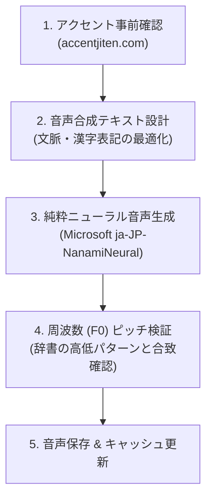

# 🎙️ 音声データ作成・アクセント管理ガイドライン

本プロジェクトにおける教材音声データ（MP3）の新規作成・更新時は、学習者にとって正確で自然な日本語アクセントを提供するため、以下のワークフローを厳格に適用します。

---

## 📌 必須ワークフロー（4ステップ）

---

### ステップ 1: アクセント事前確認（基準の確定）
- **辞書サイト**: [https://accentjiten.com/](https://accentjiten.com/)（NHKアクセント辞典・OJAD準拠）
- 対象単語のアクセント型（頭高型・中高型・尾高型・平板型）および、どの拍が高く・低いかを事前に確認します。
  - 例：
    - **雨（あめ）**: 頭高型【1型】 `あ↑め↓`
    - **飴（あめ）**: 平板型【0型】 `あ↓め↑`
    - **九月（くがつ）**: 尾高型【1型〜2型】 `く↑が↓つ↓`
    - **八時（はちじ）**: 尾高型【2型】 `は↑ち↑じ↓`

---

### ステップ 2: 音声合成テキスト設計（同音異義語・語頭高低の制御）
- 単語単体でAI音声エンジンに渡すと、最頻出パターンに偏る（例：「飴」が「雨」と同じ頭高型になる）場合があります。
- 対策：
  - **最適な表記選択**: ひらがな単体で誤読される場合は、適切な漢字表記（`九月`、`八時` 等）を指定する。
  - **文脈付与・切り出し**: 「飴を食べる」「甘い飴」など自然なフレーズとして読ませ、単語部分を抽出・生成する。

---

### ステップ 3: 純粋ニューラル音声生成（加工禁止）
- **使用エンジン**: Microsoft Azure Neural Voice (`ja-JP-NanamiNeural`)
- **禁止事項**: 音声ピッチシフター（rubberband等）によるデジタル波形加工は、フォルマントの歪みや雑音・こもり音の原因となるため**一切禁止**。必ず純粋なニューラル出力を使用する。

---

### ステップ 4: 周波数（F0）ピッチ解析による合致検証
- `scripts/analyze_pitch.py` や自動F0追跡スクリプトを用いて、各モーラの音高（Hz）を算出。
- accentjiten.com で確認した高低パターンと合致していることを確認した上で本番ファイルへ保存する。

---

### ステップ 5: デプロイとキャッシュバスター更新
- 生成後は `js/speech-data.js` を更新。
- ブラウザ側のキャッシュ残りによる旧音声再生を防ぐため、`index.html` および `js/viewer.js` のキャッシュバスター（`v=X.X`）を必ず1段階インクリメントしてコミット・プッシュする。
